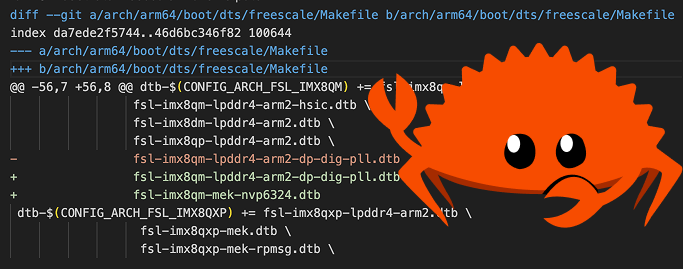

# spatch

Utility for splitting git patch files into smaller patches, one per each modified file.



## Features

- separate enormous patches into smaller ones
- filter which patches to extract based on the new filename using either `--glob` or `--regex`
- extract _only_ patches for newly added files 
- extract newly added files -- creates the directory structure and writes the file contents
- read from stdin if `--files` is missing
- rusty!

## Usage

```
Usage: spatch [OPTIONS]

Options:
  -o, --output-dir <OUTPUT_DIR>  Output directory for split patches
  -n, --only-new                 Only extract patches for newly added files
  -x, --extract-file             Extract new files contents rather than patches
      --regex <REGEX>            Filter patches by filename regex
      --glob <GLOB>              Filter patches by filename glob pattern
      --files <FILES>...         Patch files to split. Reads from stdin if not specified
  -h, --help                     Print help
  -V, --version                  Print version
```

## Installation

1. Install rust
2. Clone this repo
3. Compile it. 
```
cargo install --path .
```

## Limitations

- no 3-way patches.
- the one true "new line" is LF. CRLF is for typewriters.
 
## Examples

- Split a patch file into per-file patches in `./out`:

```
spatch --files big.patch --output-dir ./out
```

- Read a patch from stdin and only keep patches touching Makefiles:

```
git format-patch -1 HEAD | spatch --glob 'arch/**/Makefile' --output-dir ./out
```

- Extract newly added files (write file contents) from a patch:

```
spatch --files changes.patch --only-new --extract-file --output-dir ./files
```

- Use a regex to select driver C files from a large patch:

```
spatch --files repo.patch --regex 'drivers/.+\\.c' --output-dir ./drivers-patches
```